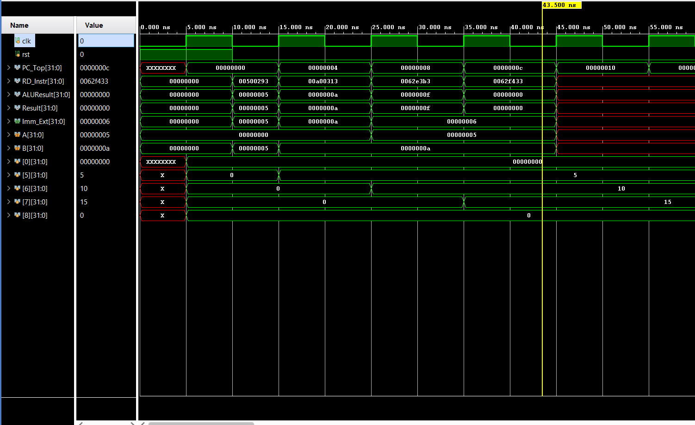

# RISC-V 32-bit Single-Cycle Processor

A functional 32-bit RISC-V CPU core implemented in Verilog. This processor supports fundamental R-type and I-type instructions and has been verified through simulation.

## 🚀 Simulation Results
The waveform below demonstrates the correct execution of the test program:
1. `addi x5, x0, 5`  -> Register x5 = 5
2. `addi x6, x0, 10` -> Register x6 = 10
3. `or x7, x5, x6`   -> Register x7 = 15

## 🛠️ Instructions for Running
1. Load the `memfile.hex` into the Instruction Memory.
2. Run the testbench `Single_Cycle_Top_Tb.v`.
3. Ensure the reset pulse is released at 15ns to capture the first instruction.