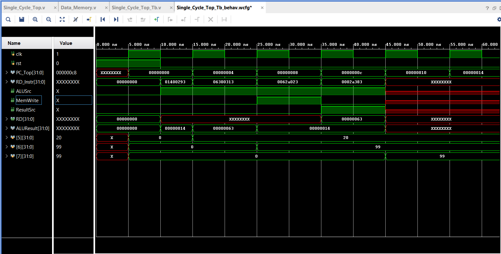

# RISC-V 32-bit Single-Cycle Processor

A functional 32-bit RISC-V CPU core implemented in Verilog. This processor supports fundamental R-type and I-type instructions and has been verified through simulation.

## 🏗️ Processor Architecture
The design follows a standard single-cycle RISC-V datapath. It includes a Control Unit for instruction decoding, a 32x32 Register File, and an ALU for arithmetic operations.

## 🚀 Simulation Results
The waveform below demonstrates the correct execution of the test program:
1. `addi x5, x0, 5`  -> Register x5 = 5
2. `addi x6, x0, 10` -> Register x6 = 10
3. `or x7, x5, x6`   -> Register x7 = 15

The waveform below demonstrates the correct execution of the Memory Access (LW/SW) test program:

1. `addi x5, x0, 20` -> Register x5 = 20 (Hex 14).

2. `addi x6, x0, 99` -> Register x6 = 99 (Hex 63).

3. `sw x6, 0(x5)`-> Stores value 99 from x6 into Memory Address 20.

4. `lw x7, 0(x5)` -> Loads value 99 from Memory Address 20 into Register x7.

## 🛠️ Instructions for Running
1. Load the `memfile.hex` into the Instruction Memory.
2. Run the testbench `Single_Cycle_Top_Tb.v`.
3. Ensure the reset pulse is released at 10ns to capture the first instruction.